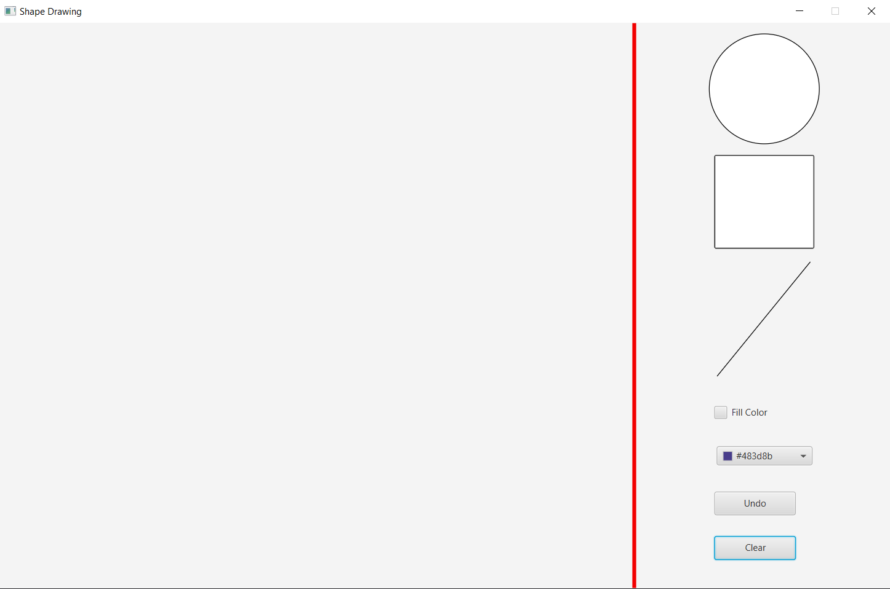

# Shape-Drawing - JavaFX
A simple shape drawing application that was created for an assignment I had in one of my courses,

All you need to do is grab a shape and place it somewhere to the left of the red line

You can choose the color of the shape, and wether it would be filled with color or not.
You can also undo the shapes you've drawn, and clear the screen from all the shapes you have created.
